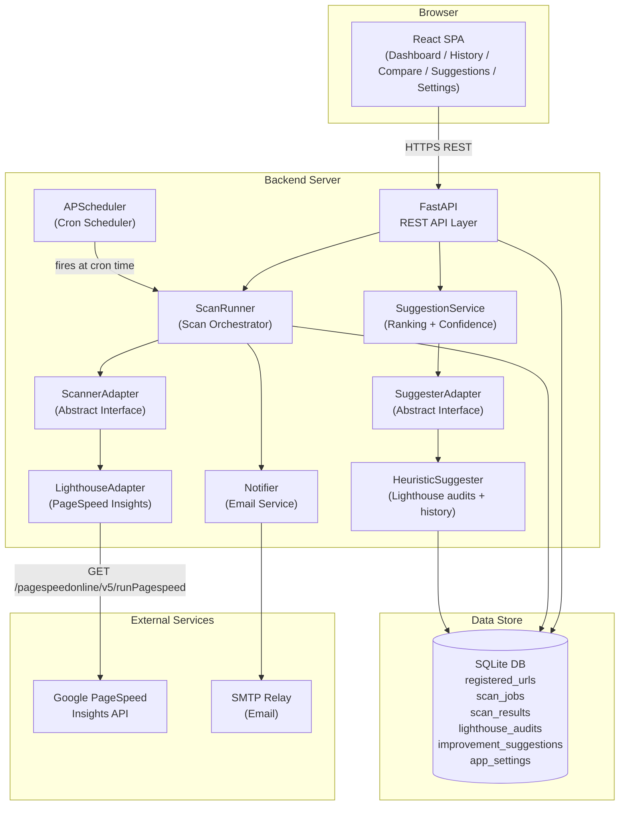
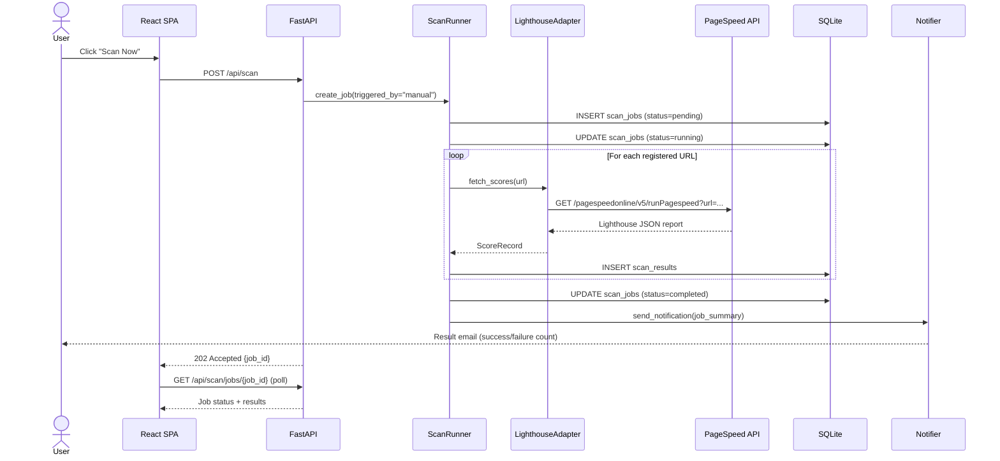
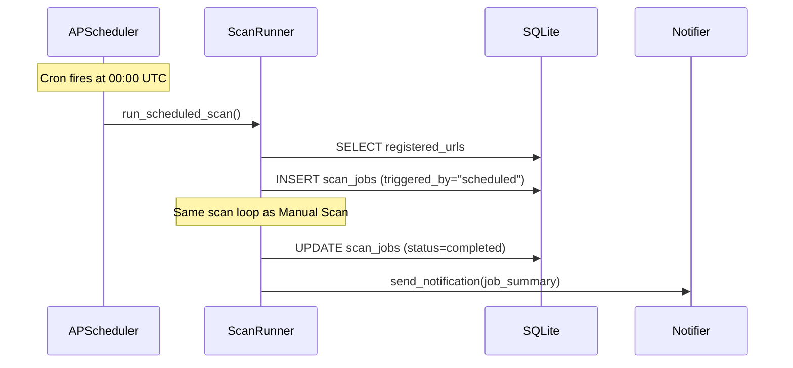
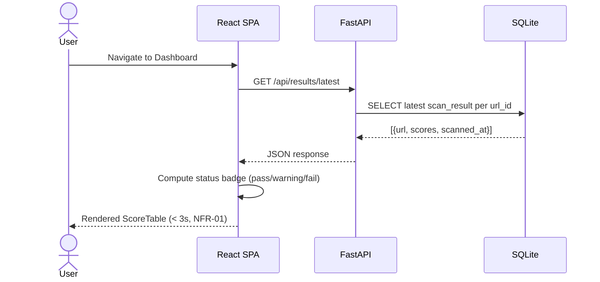
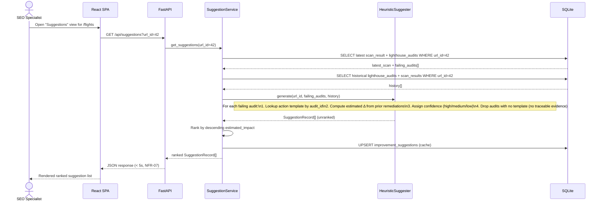
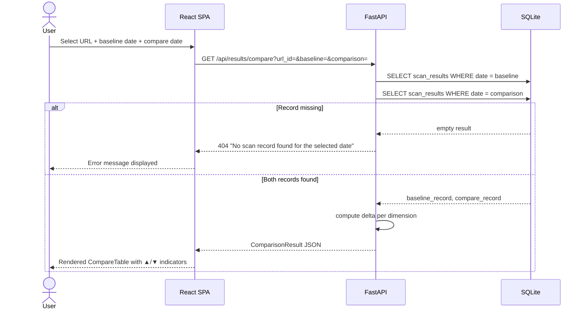
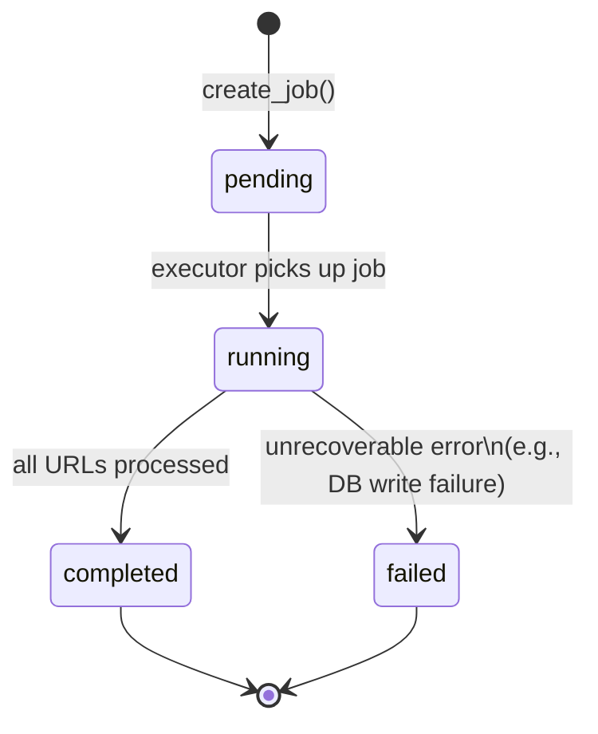
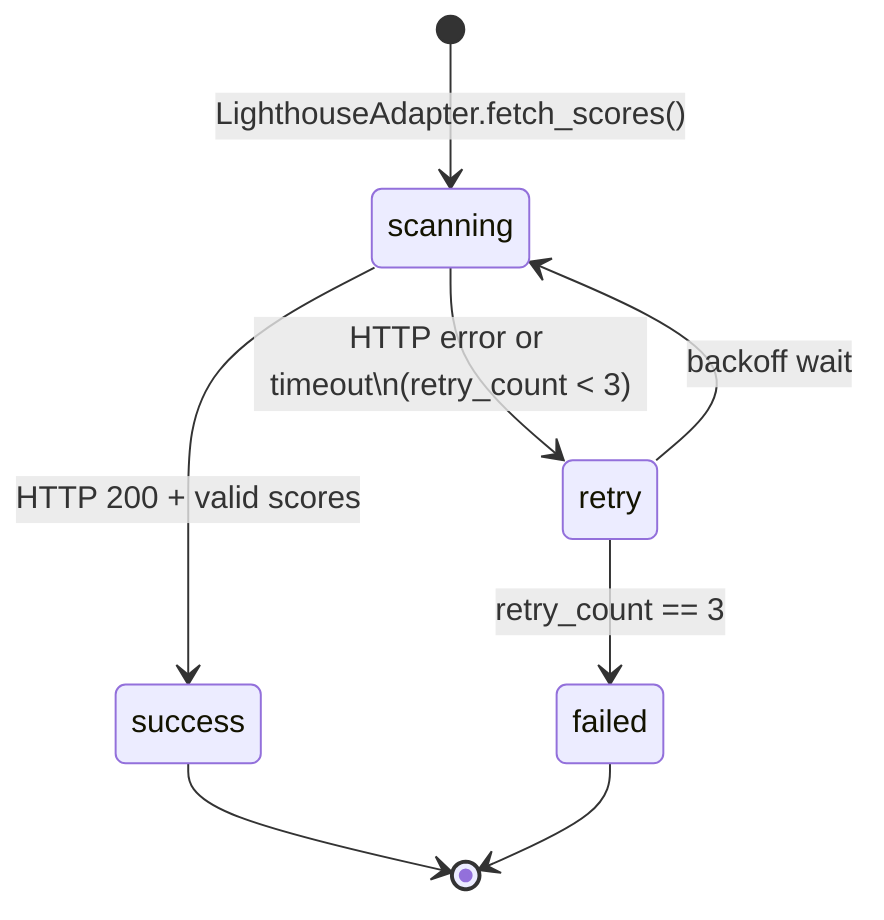
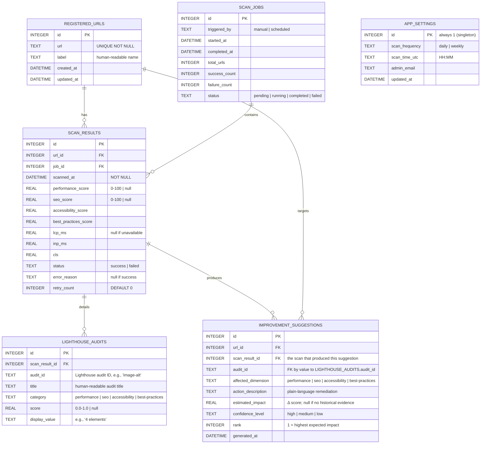

# System Design Document

> **Source**: [requirements.md](requirements.md)
> **Status**: Draft
> **Last Updated**: 2026-05-18

---

## Table of Contents

1. System Overview
2. Technology Stack
3. Component Architecture
4. Data Flow
5. State Transitions
6. Data Schema
7. API Design
8. Directory Structure
9. UI Design Overview
10. Adapter Interface Definition

---

## 1. System Overview

The SEO Evaluation System is a web-based monitoring platform that:

1. Accepts a registry of target page URLs managed.
2. Executes automated Lighthouse scans — via the Google PageSpeed Insights API — on a configurable schedule.
3. Persists all score records historically in a relational database.
4. Presents current and historical scores on an interactive dashboard.
5. Generates ranked, evidence-linked SEO improvement suggestions for SEO specialists, derived from the latest Lighthouse audits and historical remediation effects (FR-08).

### Design Principle

> **Minimum Viable Architecture** — a single-server, three-tier design is chosen for the MVP. The Lighthouse integration is encapsulated behind an Adapter Interface per NFR-05, so the scoring provider can be swapped later. The suggestion engine follows the same Adapter pattern so that the heuristic MVP implementation can be replaced by an ML/LLM-backed implementation without altering the dashboard or API contract.

---

## 2. Technology Stack

| Layer | Technology | Rationale |
|---|---|---|
| **Frontend** | React + Vite + TypeScript | SPA with fast HMR; Chart.js for time-series charts |
| **Backend** | Python 3.12 + FastAPI | Async HTTP server; Pydantic validation; OpenAPI docs auto-generated |
| **Scheduler** | APScheduler (in-process) | Zero-infrastructure scheduling; supports cron expressions |
| **SEO Scanner** | Google PageSpeed Insights API | Server-side Lighthouse runner; no headless Chrome installation required |
| **Suggestion Engine** | Heuristic rule engine over Lighthouse audit IDs + historical scan deltas | Zero external dependency for MVP; encapsulated behind `SuggesterAdapter` (NFR-05) so it can later be swapped for an LLM- or ML-backed implementation |
| **Database** | SQLite (via SQLAlchemy ORM) | Zero-config for MVP; adapter layer allows migration to PostgreSQL |
| **Email** | Python `smtplib` | Standard library; SMTP relay configurable via environment variables |
| **Containerization** | Docker + docker-compose | Reproducible environment; single `docker-compose up` to start |

---

## 3. Component Architecture



### Component Responsibilities

| Component | Responsibility | Requirement |
|---|---|---|
| **React SPA** | Renders all 6 pages; calls REST API | FR-01, FR-04, FR-05, FR-07, FR-08 |
| **FastAPI API Layer** | Route handling, request validation | All FRs |
| **ScanRunner** | Creates scan jobs, iterates URLs, persists per-audit detail, retries on failure (max 3×) | FR-02, FR-06, FR-08 |
| **APScheduler** | Fires ScanRunner at configured cron time | FR-06 |
| **ScannerAdapter** | Abstract base class — `fetch_scores(url) → ScoreRecord` | NFR-05 |
| **LighthouseAdapter** | Calls PageSpeed Insights API; maps response to `ScoreRecord` **and** per-audit detail (`AuditRecord[]`) | FR-02, FR-03, FR-08 |
| **SuggesterAdapter** | Abstract base class — `generate(url_id, latest_audits, history) → SuggestionRecord[]` | NFR-05, NFR-08 |
| **HeuristicSuggester** | MVP implementation: maps failing Lighthouse audits to action templates; estimates Δ from comparable historical remediations | FR-08, NFR-08 |
| **SuggestionService** | Orchestrates the call to `SuggesterAdapter`, applies ranking & confidence rules, caches results | FR-08, NFR-07 |
| **Notifier** | Sends scan-completion email via SMTP | FR-06 |
| **SQLite DB** | Persists all domain data including per-audit detail and cached suggestions | FR-01~08 |

---

## 4. Data Flow

### 4.1 Manual Scan



### 4.2 Scheduled Scan



### 4.3 Dashboard Load



### 4.4 Suggestion Generation — FR-08



> The suggestion result is cached per `(url_id, scan_id)` so subsequent reads avoid re-computation; the cache is invalidated when a new scan record arrives for the URL.

### 4.5 Score Comparison



---

## 5. State Transitions

### 5.1 ScanJob State Machine



| Transition | Trigger | Side Effect |
|---|---|---|
| `[*] → pending` | `POST /api/scan` or APScheduler fires | Row inserted in `scan_jobs` |
| `pending → running` | ScanRunner.execute() starts | `started_at` timestamp written |
| `running → completed` | All URL scans finished | `completed_at` written; email sent |
| `running → failed` | Unrecoverable exception | Error logged; email sent with failure |

### 5.2 ScanResult State Machine (per URL)



---

## 6. Data Schema

### Entity Relationship Diagram



### Suggestion Confidence Rule (FR-08, AC-11)

```text
sample_size = COUNT(historical remediations of the same audit_id with measurable Δ on the same url_id)

confidence = "high"   if sample_size ≥ 5
confidence = "medium" if 2 ≤ sample_size ≤ 4
confidence = "low"    if sample_size ≤ 1   (estimated_impact = NULL when sample_size == 0)
```

### Score Status Computation Rule

```text
status = "fail"    if ANY dimension_score < 50
status = "warning" if ANY dimension_score < 90  (and no score < 50)
status = "pass"    if ALL dimension_scores ≥ 90
```

> CWV metrics (LCP, INP, CLS) are displayed separately and do NOT feed into the status badge calculation.

---

## 7. API Design

All endpoints are prefixed `/api`. All requests/responses use `application/json`.

### URL Management — FR-01

| Method | Path | Request Body | Response |
|---|---|---|---|
| `GET` | `/api/urls` | — | `[{ id, url, label, created_at }]` |
| `POST` | `/api/urls` | `{ url, label? }` | `{ id, url, label, created_at }` — 201 Created |
| `DELETE` | `/api/urls/{id}` | — | 204 No Content |

### Scan — FR-02, FR-06

| Method | Path | Description | Response |
|---|---|---|---|
| `POST` | `/api/scan` | Trigger manual scan | `{ job_id }` — 202 Accepted |
| `GET` | `/api/scan/jobs` | List all scan jobs | `[ScanJob]` |
| `GET` | `/api/scan/jobs/{id}` | Get job status + result summary | `ScanJob` |

### Results — FR-04, FR-05, FR-07

| Method | Path | Query Params | Response |
|---|---|---|---|
| `GET` | `/api/results/latest` | — | `[LatestResult]` — one per registered URL |
| `GET` | `/api/results/history` | `url_id, from (ISO date), to (ISO date)` | `[ScanResult]` |
| `GET` | `/api/results/compare` | `url_id, baseline (ISO date), comparison (ISO date)` | `ComparisonResult` |
| `GET` | `/api/results/export` | `url_id, from, to` | `text/csv` attachment |

### Suggestions — FR-08

| Method | Path | Query Params | Response |
|---|---|---|---|
| `GET` | `/api/suggestions` | `url_id` (required) | `{ url_id, scan_id, generated_at, suggestions: SuggestionRecord[] }` — items ranked by descending `estimated_impact` |
| `GET` | `/api/suggestions/audits` | `url_id, scan_id?` | `[AuditRecord]` — raw per-audit detail used as suggestion evidence (NFR-08 traceability) |

`SuggestionRecord` schema:

```json
{
  "audit_id":           "image-alt",
  "affected_dimension": "accessibility",
  "action_description": "Add `alt` attributes to all  elements on the page.",
  "estimated_impact":   3.5,
  "confidence_level":   "medium",
  "rank":               2,
  "evidence": {
    "sample_size":       3,
    "historical_scan_ids": [108, 142, 173]
  }
}
```

> When `estimated_impact == null`, the UI must render the field as `"N/A"` and `confidence_level` must be `"low"` (AC-11).

### Settings — FR-06

| Method | Path | Request Body | Response |
|---|---|---|---|
| `GET` | `/api/settings` | — | `AppSettings` |
| `PUT` | `/api/settings` | `{ scan_frequency, scan_time_utc, admin_email }` | `AppSettings` |

---

## 8. Directory Structure

```text
AI-SEO/
├── backend/
│   ├── app/
│   │   ├── api/
│   │   │   ├── urls.py          # FR-01: URL CRUD
│   │   │   ├── scan.py          # FR-02, FR-06: job trigger + status
│   │   │   ├── results.py       # FR-04, FR-05, FR-07: dashboard + history + compare
│   │   │   ├── suggestions.py   # FR-08: ranked SEO improvement suggestions
│   │   │   └── settings.py      # FR-06: schedule + email config
│   │   ├── core/
│   │   │   ├── config.py        # Env vars (API key, SMTP, JWT secret)
│   │   │   ├── database.py      # SQLAlchemy engine + session factory
│   │   │   └── scheduler.py     # APScheduler init + job registration
│   │   ├── models/
│   │   │   ├── url.py           # RegisteredUrl ORM model
│   │   │   ├── scan_job.py      # ScanJob ORM model
│   │   │   ├── scan_result.py   # ScanResult ORM model
│   │   │   ├── lighthouse_audit.py     # LighthouseAudit ORM model — FR-08 evidence
│   │   │   ├── suggestion.py           # ImprovementSuggestion ORM model — FR-08
│   │   │   └── settings.py      # AppSettings ORM model
│   │   ├── schemas/
│   │   │   ├── url.py           # Pydantic request/response schemas
│   │   │   ├── scan.py
│   │   │   ├── result.py
│   │   │   └── suggestion.py    # SuggestionRecord, AuditRecord schemas
│   │   └── services/
│   │       ├── scanner/
│   │       │   ├── base.py      # ScannerAdapter (Abstract Base Class) — NFR-05
│   │       │   └── lighthouse.py # LighthouseAdapter: calls PageSpeed Insights API + emits AuditRecord[]
│   │       ├── suggester/
│   │       │   ├── base.py      # SuggesterAdapter (Abstract Base Class) — NFR-05, NFR-08
│   │       │   ├── heuristic.py # HeuristicSuggester: rule-based MVP implementation
│   │       │   ├── templates.py # Static map: lighthouse audit_id → action_description, affected_dimension
│   │       │   └── service.py   # SuggestionService: ranking, confidence, caching
│   │       ├── scan_runner.py   # Orchestrates scan jobs + retry logic (max 3×)
│   │       └── notifier.py      # Email notification via smtplib
│   ├── tests/
│   │   ├── test_urls.py
│   │   ├── test_scan.py
│   │   ├── test_results.py
│   │   └── test_suggestions.py  # FR-08, AC-10, AC-11
│   ├── main.py                  # FastAPI app entry point
│   └── requirements.txt
├── frontend/
│   ├── src/
│   │   ├── components/
│   │   │   ├── ScoreTable.tsx   # FR-04: URL rows with status badges
│   │   │   ├── TrendChart.tsx   # FR-05: Chart.js line chart
│   │   │   ├── CompareTable.tsx # FR-07: Delta table with ▲/▼
│   │   │   ├── StatusBadge.tsx  # Pass / Warning / Fail badge
│   │   │   ├── SuggestionList.tsx # FR-08: ranked suggestion cards
│   │   │   └── Navbar.tsx
│   │   ├── pages/
│   │   │   ├── Dashboard.tsx    # FR-04
│   │   │   ├── UrlManager.tsx   # FR-01
│   │   │   ├── History.tsx      # FR-05
│   │   │   ├── Compare.tsx      # FR-07
│   │   │   ├── Suggestions.tsx  # FR-08
│   │   │   └── Settings.tsx     # FR-06
│   │   ├── api/
│   │   │   └── client.ts        # Axios instance + typed API calls
│   │   └── main.tsx
│   ├── index.html
│   ├── vite.config.ts
│   └── package.json
├── specs/
│   ├── user_story.md
│   ├── requirements.md
│   ├── design.md                # ← this file
│   ├── implementation_plan.md
│   └── walkthrough.md
├── .env.example                 # PAGESPEED_API_KEY, SMTP_HOST, JWT_SECRET, etc.
├── docker-compose.yml
└── README.md
```

---

## 9. UI Design Overview

### 9.1 Page Map

```text
/               → Dashboard       (FR-04)
/urls           → URL Manager     (FR-01)
/history        → History View    (FR-05)
/compare        → Score Comparison (FR-07)
/suggestions    → SEO Improvement Suggestions (FR-08)
/settings       → Scheduler & Email Settings (FR-06)
```

### 9.2 Dashboard Page — `/` (FR-04)

```text
┌──────────────────────────────────────────────────────────────────┐
│  SEO Monitor                                [Scan Now]  [⚙ Admin] │
├────────────────────┬──────────┬──────────┬──────────┬───────────┤
│  Page URL          │ Perf     │ SEO      │ A11y     │ Best P.   │
├────────────────────┼──────────┼──────────┼──────────┼───────────┤
│ /flights           │ 🟢 92   │ 🟢 88   │ 🟡 74   │ 🟢 95    │
│ /hotels            │ 🟡 65   │ 🔴 45   │ 🟢 81   │ 🟡 70    │
│ /top               │ 🟢 88   │ 🟢 91   │ 🟢 89   │ 🟢 87    │
├────────────────────┴──────────┴──────────┴──────────┴───────────┤
│  Last scan: 2026-05-17 00:02 UTC              🟢 pass  🟡 warn  🔴 fail │
└──────────────────────────────────────────────────────────────────┘
```

- Status badge rule: `🟢 pass` = all scores ≥ 90 | `🟡 warning` = any score 50–79 | `🔴 fail` = any score < 50
- "Scan Now" button triggers `POST /api/scan`; a spinner is shown during polling

### 9.3 History Page — `/history` (FR-05)

```text
┌──────────────────────────────────────────────────────────────────┐
│  History  [/flights ▼]   From [2026-04-01]  To [2026-05-17]  [Go]│
├──────────────────────────────────────────────────────────────────┤
│                                                                    │
│  100 ─ ─ ─ ─ ─ ─ ─ ─ ─ ─ ─ ─ ─ ─ ─ ─ ─ ─ ─ ─ ─ ─ ─ ─ ─     │
│   80 ━━━━━━━━━━━━━━━━━━━━━━━━━ Performance                        │
│   60 ──────────────────────────── SEO                             │
│   40                                                               │
│    0 ┴──────────┴──────────┴──────────┴──────────                 │
│      Apr 1      Apr 15     May 1      May 15                       │
│                                                                    │
│  Legend:  ━ Performance  ─ SEO  ┄ Accessibility  ··· Best Pract. │
├──────────────────────────────────────────────────────────────────┤
│                                              [Export CSV]          │
└──────────────────────────────────────────────────────────────────┘
```

### 9.4 Compare Page — `/compare` (FR-07)

```
┌──────────────────────────────────────────────────────────────────┐
│  Compare  [/flights ▼]  Baseline [2026-04-01]  vs [2026-05-17]  [Go]│
├──────────────────────┬────────────┬────────────┬────────────────┤
│  Dimension           │ Baseline   │ Compare    │ Delta          │
├──────────────────────┼────────────┼────────────┼────────────────┤
│  Performance         │    72      │    88      │ 🟢 ▲ +16      │
│  SEO                 │    60      │    45      │ 🔴 ▼ -15      │
│  Accessibility       │    80      │    83      │ 🟢 ▲ +3       │
│  Best Practices      │    75      │    78      │ 🟢 ▲ +3       │
│  LCP (ms)            │   4200     │   2800     │ 🟢 ▲ -1400    │
│  INP (ms)            │    320     │    180     │ 🟢 ▲ -140     │
│  CLS                 │   0.25     │   0.08     │ 🟢 ▲ -0.17    │
└──────────────────────┴────────────┴────────────┴────────────────┘
```

> For CWV metrics (LCP, INP, CLS), a lower value is better. Delta display logic must be inverted for directional color coding.

### 9.5 Suggestions Page — `/suggestions` (FR-08)

```text
┌──────────────────────────────────────────────────────────────────────┐
│  Suggestions  [/flights ▼]                Last scan: 2026-05-18 00:02 │
├──────────────────────────────────────────────────────────────────────┤
│  Rank  Dimension       Action                       Δ Impact  Conf.  │
├──────────────────────────────────────────────────────────────────────┤
│   1   Performance     Defer offscreen images        🟢 +12   high    │
│       ⮡ audit: offscreen-images   evidence: 6 prior scans            │
├──────────────────────────────────────────────────────────────────────┤
│   2   Accessibility   Add `alt` attributes to   🟢 +3.5  medium │
│       ⮡ audit: image-alt         evidence: 3 prior scans             │
├──────────────────────────────────────────────────────────────────────┤
│   3   SEO             Provide a meta description     ⚪ N/A   low    │
│       ⮡ audit: meta-description   evidence: none                     │
└──────────────────────────────────────────────────────────────────────┘
```

- The list is sorted by descending **Estimated Impact** (Δ). Items with `confidence == "low"` and `estimated_impact == null` are rendered last with `N/A` (AC-11).
- Each row is expandable to show the originating Lighthouse audit detail (`display_value`, `title`) for traceability (NFR-08).
- The view fetches `GET /api/suggestions?url_id=…` on mount; spinner is shown until response (≤ 5 s per NFR-07).

### 9.6 Settings Page — `/settings` (FR-06)

```text
┌──────────────────────────────────────────────────────────────────┐
│  Settings                                                          │
│                                                                    │
│  Scan Schedule                                                     │
│    Frequency:  ( ) Daily  ( ) Weekly                               │
│    Time (UTC): [00:00]                                             │
│                                                                    │
│  Notification                                                      │
│    Admin Email: [admin@ota-example.com               ]            │
│                                                                    │
│                                          [Save Settings]           │
└──────────────────────────────────────────────────────────────────┘
```

---

## 10. Adapter Interface Definition

Per NFR-05, both the scanner integration and the suggestion engine are isolated behind abstract classes. The concrete `LighthouseAdapter` can be replaced (e.g., with a `MozAdapter` or `SemrushAdapter`); the concrete `HeuristicSuggester` can be replaced by an `LLMSuggester` or `MLSuggester` — by implementing the same interface.

### 10.1 ScannerAdapter (FR-02, FR-03, FR-08)

```python
# backend/app/services/scanner/base.py

from abc import ABC, abstractmethod
from dataclasses import dataclass, field
from typing import List, Optional

@dataclass
class AuditRecord:
    audit_id:      str            # e.g., "image-alt"
    title:         str
    category:      str            # performance | seo | accessibility | best-practices
    score:         Optional[float]  # 0.0 - 1.0; None if not applicable
    display_value: Optional[str]    # e.g., "4 elements"

@dataclass
class ScoreRecord:
    performance_score:     Optional[float]  # 0-100
    seo_score:             Optional[float]  # 0-100
    accessibility_score:   Optional[float]  # 0-100
    best_practices_score:  Optional[float]  # 0-100
    lcp_ms:                Optional[float]
    inp_ms:                Optional[float]
    cls:                   Optional[float]
    audits:                List[AuditRecord] = field(default_factory=list)  # FR-08 evidence

class ScannerAdapter(ABC):
    @abstractmethod
    def fetch_scores(self, url: str) -> ScoreRecord:
        """Fetch SEO scores and per-audit detail for the given URL."""
        ...
```

### 10.2 SuggesterAdapter (FR-08, NFR-05, NFR-08)

```python
# backend/app/services/suggester/base.py

from abc import ABC, abstractmethod
from dataclasses import dataclass
from typing import List, Optional

@dataclass
class SuggestionRecord:
    audit_id:             str             # traceability to AuditRecord.audit_id (NFR-08)
    affected_dimension:   str             # performance | seo | accessibility | best-practices
    action_description:   str             # plain-language remediation
    estimated_impact:     Optional[float] # Δ score; None when no historical evidence
    confidence_level:     str             # "high" | "medium" | "low"
    rank:                 int             # 1 = highest expected impact
    historical_scan_ids:  List[int]       # NFR-08 traceability

class SuggesterAdapter(ABC):
    @abstractmethod
    def generate(
        self,
        url_id: int,
        latest_audits: List["AuditRecord"],
        history: List["AuditRecord"],
    ) -> List[SuggestionRecord]:
        """Produce a ranked list of SEO improvement suggestions.

        Implementations MUST:
        - drop any audit for which no traceable evidence exists (FR-08 constraint)
        - return items sorted by descending `estimated_impact` (None sorts last)
        """
        ...
```

> The MVP implementation `HeuristicSuggester` resolves `audit_id → (affected_dimension, action_description)` via a static template map (`templates.py`) and computes `estimated_impact` as the mean Δ of the same `audit_id` across the URL's history. The same interface allows a future `LLMSuggester` to call out to an LLM with the audit list and history as context — no other component changes.
