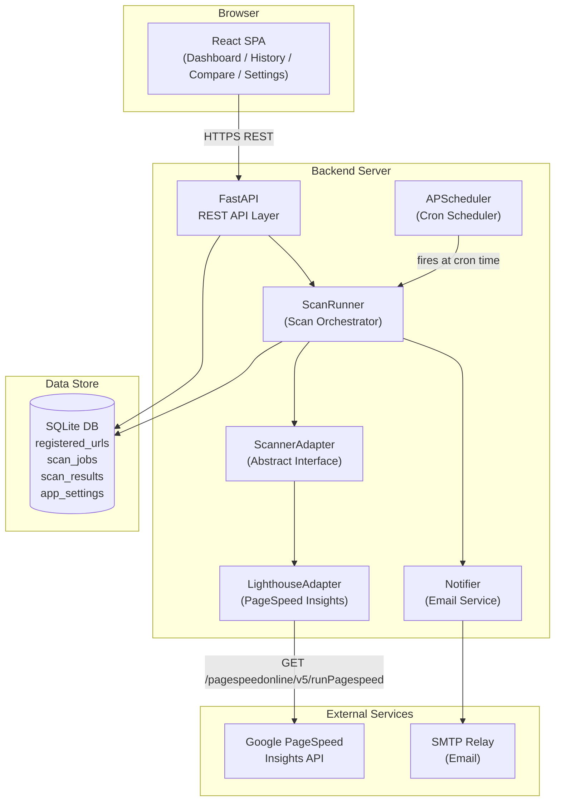
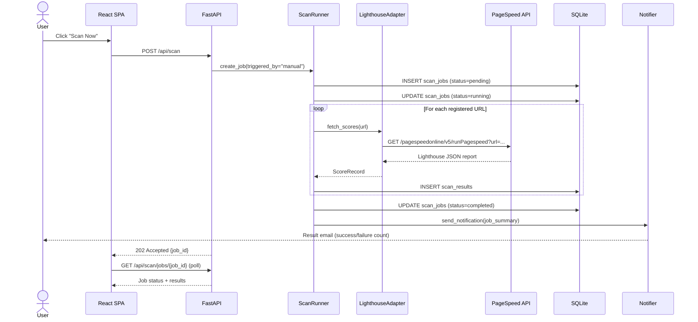
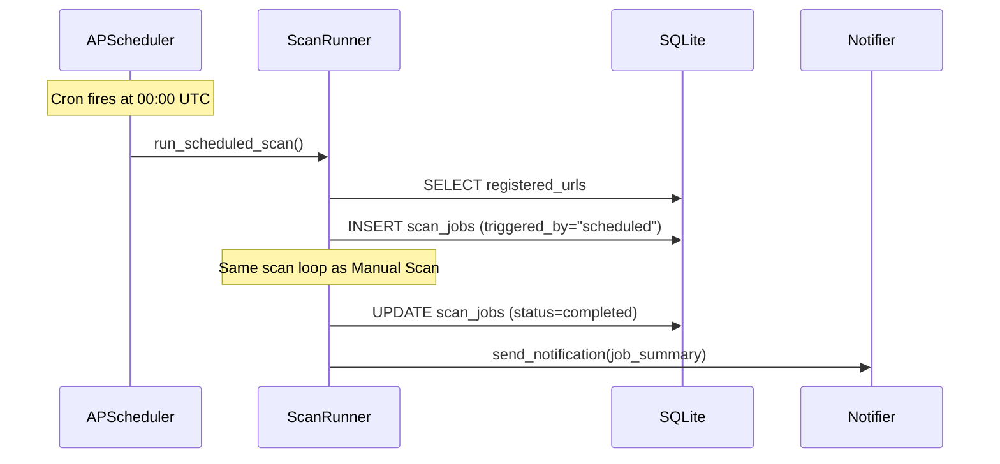
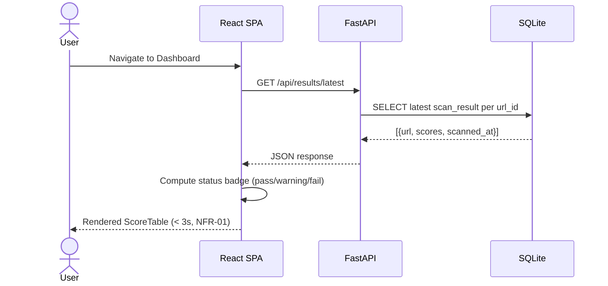
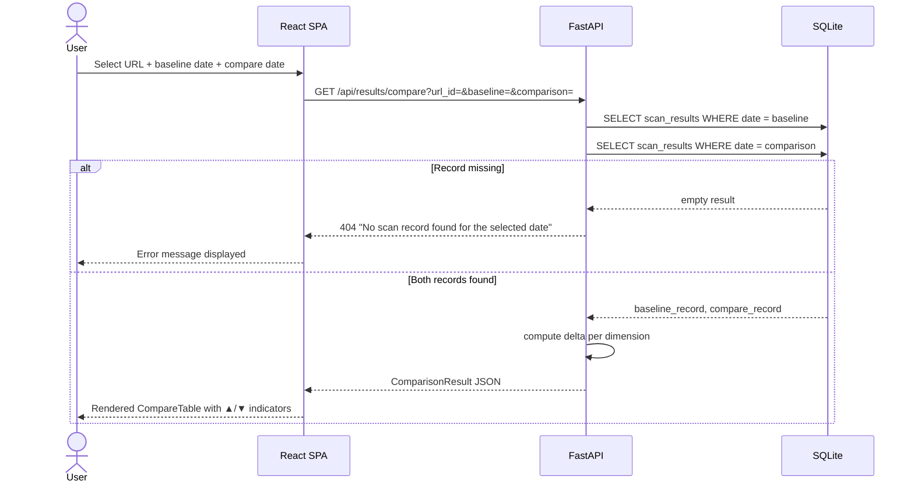
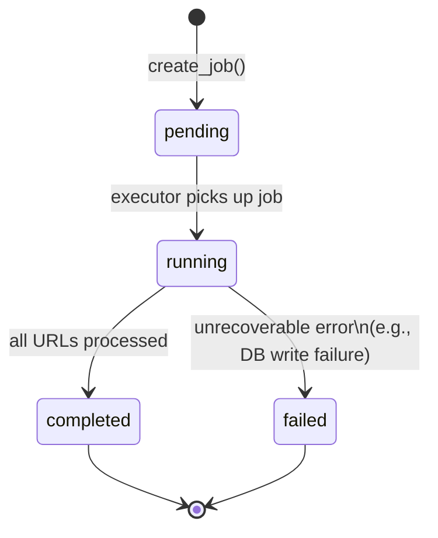
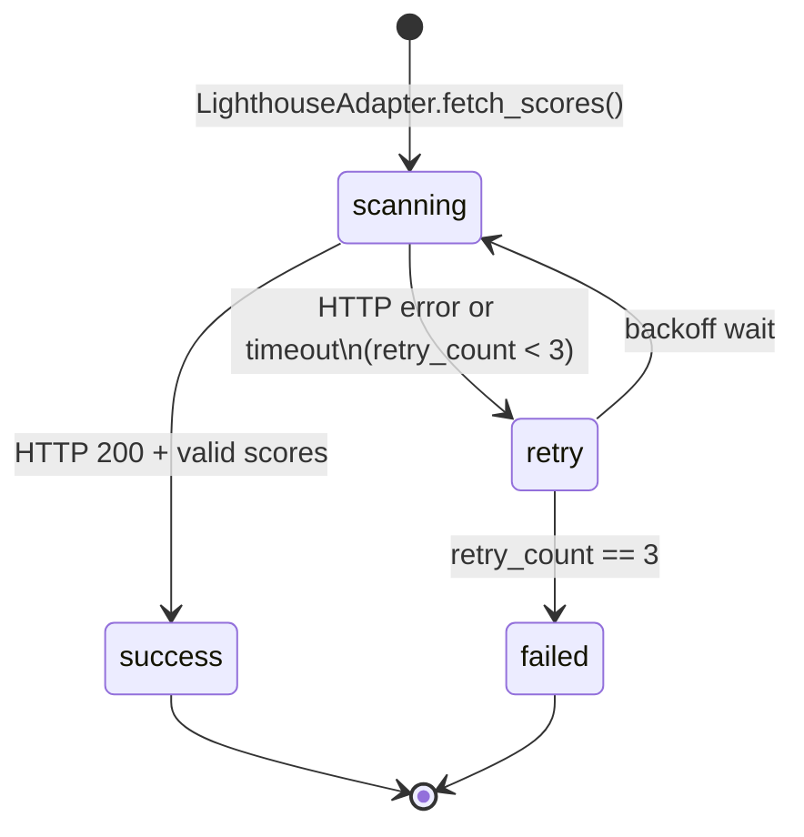
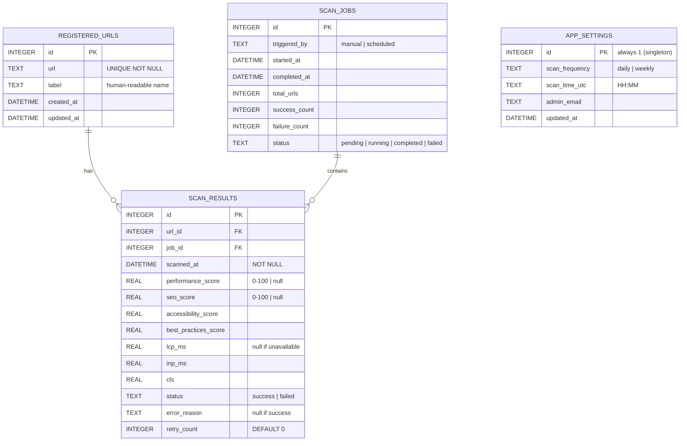

# System Design Document

> **Source**: [requirements.md](requirements.md)
> **Status**: Draft
> **Last Updated**: 2026-05-17

---

## Table of Contents

1. System Overview
2. Technology Stack
3. Component Architecture
4. Data Flow
5. State Transitions
6. Data Schema
7. API Design
8. Directory Structure
9. UI Design Overview

---

## 1. System Overview

The SEO Evaluation System is a web-based monitoring platform that:

1. Accepts a registry of target page URLs managed.
2. Executes automated Lighthouse scans — via the Google PageSpeed Insights API — on a configurable schedule.
3. Persists all score records historically in a relational database.
4. Presents current and historical scores on an interactive dashboard.

### Design Principle

> **Minimum Viable Architecture** — a single-server, three-tier design is chosen for the MVP. The Lighthouse integration is encapsulated behind an Adapter Interface per NFR-05, so the scoring provider can be swapped later.

---

## 2. Technology Stack

| Layer | Technology | Rationale |
|---|---|---|
| **Frontend** | React + Vite + TypeScript | SPA with fast HMR; Chart.js for time-series charts |
| **Backend** | Python 3.12 + FastAPI | Async HTTP server; Pydantic validation; OpenAPI docs auto-generated |
| **Scheduler** | APScheduler (in-process) | Zero-infrastructure scheduling; supports cron expressions |
| **SEO Scanner** | Google PageSpeed Insights API | Server-side Lighthouse runner; no headless Chrome installation required |
| **Database** | SQLite (via SQLAlchemy ORM) | Zero-config for MVP; adapter layer allows migration to PostgreSQL |
| **Email** | Python `smtplib` | Standard library; SMTP relay configurable via environment variables |
| **Containerization** | Docker + docker-compose | Reproducible environment; single `docker-compose up` to start |

---

## 3. Component Architecture



### Component Responsibilities

| Component | Responsibility | Requirement |
|---|---|---|
| **React SPA** | Renders all 5 pages; calls REST API | FR-01, FR-04, FR-05, FR-07 |
| **FastAPI API Layer** | Route handling, request validation | All FRs |
| **ScanRunner** | Creates scan jobs, iterates URLs, retries on failure (max 3×) | FR-02, FR-06 |
| **APScheduler** | Fires ScanRunner at configured cron time | FR-06 |
| **ScannerAdapter** | Abstract base class — `fetch_scores(url) → ScoreRecord` | NFR-05 |
| **LighthouseAdapter** | Calls PageSpeed Insights API; maps response to `ScoreRecord` | FR-02, FR-03 |
| **Notifier** | Sends scan-completion email via SMTP | FR-06 |
| **SQLite DB** | Persists all domain data | FR-01~07 |

---

## 4. Data Flow

### 4.1 Manual Scan



### 4.2 Scheduled Scan



### 4.3 Dashboard Load



### 4.4 Score Comparison



---

## 5. State Transitions

### 5.1 ScanJob State Machine



| Transition | Trigger | Side Effect |
|---|---|---|
| `[*] → pending` | `POST /api/scan` or APScheduler fires | Row inserted in `scan_jobs` |
| `pending → running` | ScanRunner.execute() starts | `started_at` timestamp written |
| `running → completed` | All URL scans finished | `completed_at` written; email sent |
| `running → failed` | Unrecoverable exception | Error logged; email sent with failure |

### 5.2 ScanResult State Machine (per URL)



---

## 6. Data Schema

### Entity Relationship Diagram



### Score Status Computation Rule

```text
status = "fail"    if ANY dimension_score < 50
status = "warning" if ANY dimension_score < 80  (and no score < 50)
status = "pass"    if ALL dimension_scores ≥ 80
```

> CWV metrics (LCP, INP, CLS) are displayed separately and do NOT feed into the status badge calculation.

---

## 7. API Design

All endpoints are prefixed `/api`. All requests/responses use `application/json`.

### URL Management — FR-01

| Method | Path | Request Body | Response |
|---|---|---|---|
| `GET` | `/api/urls` | — | `[{ id, url, label, created_at }]` |
| `POST` | `/api/urls` | `{ url, label? }` | `{ id, url, label, created_at }` — 201 Created |
| `DELETE` | `/api/urls/{id}` | — | 204 No Content |

### Scan — FR-02, FR-06

| Method | Path | Description | Response |
|---|---|---|---|
| `POST` | `/api/scan` | Trigger manual scan | `{ job_id }` — 202 Accepted |
| `GET` | `/api/scan/jobs` | List all scan jobs | `[ScanJob]` |
| `GET` | `/api/scan/jobs/{id}` | Get job status + result summary | `ScanJob` |

### Results — FR-04, FR-05, FR-07

| Method | Path | Query Params | Response |
|---|---|---|---|
| `GET` | `/api/results/latest` | — | `[LatestResult]` — one per registered URL |
| `GET` | `/api/results/history` | `url_id, from (ISO date), to (ISO date)` | `[ScanResult]` |
| `GET` | `/api/results/compare` | `url_id, baseline (ISO date), comparison (ISO date)` | `ComparisonResult` |
| `GET` | `/api/results/export` | `url_id, from, to` | `text/csv` attachment |

### Settings — FR-06

| Method | Path | Request Body | Response |
|---|---|---|---|
| `GET` | `/api/settings` | — | `AppSettings` |
| `PUT` | `/api/settings` | `{ scan_frequency, scan_time_utc, admin_email }` | `AppSettings` |

---

## 8. Directory Structure

```text
AI-SEO/
├── backend/
│   ├── app/
│   │   ├── api/
│   │   │   ├── urls.py          # FR-01: URL CRUD
│   │   │   ├── scan.py          # FR-02, FR-06: job trigger + status
│   │   │   ├── results.py       # FR-04, FR-05, FR-07: dashboard + history + compare
│   │   │   └── settings.py      # FR-06: schedule + email config
│   │   ├── core/
│   │   │   ├── config.py        # Env vars (API key, SMTP, JWT secret)
│   │   │   ├── database.py      # SQLAlchemy engine + session factory
│   │   │   └── scheduler.py     # APScheduler init + job registration
│   │   ├── models/
│   │   │   ├── url.py           # RegisteredUrl ORM model
│   │   │   ├── scan_job.py      # ScanJob ORM model
│   │   │   ├── scan_result.py   # ScanResult ORM model
│   │   │   └── settings.py      # AppSettings ORM model
│   │   ├── schemas/
│   │   │   ├── url.py           # Pydantic request/response schemas
│   │   │   ├── scan.py
│   │   │   └── result.py
│   │   └── services/
│   │       ├── scanner/
│   │       │   ├── base.py      # ScannerAdapter (Abstract Base Class) — NFR-05
│   │       │   └── lighthouse.py # LighthouseAdapter: calls PageSpeed Insights API
│   │       ├── scan_runner.py   # Orchestrates scan jobs + retry logic (max 3×)
│   │       └── notifier.py      # Email notification via smtplib
│   ├── tests/
│   │   ├── test_urls.py
│   │   ├── test_scan.py
│   │   └── test_results.py
│   ├── main.py                  # FastAPI app entry point
│   └── requirements.txt
├── frontend/
│   ├── src/
│   │   ├── components/
│   │   │   ├── ScoreTable.tsx   # FR-04: URL rows with status badges
│   │   │   ├── TrendChart.tsx   # FR-05: Chart.js line chart
│   │   │   ├── CompareTable.tsx # FR-07: Delta table with ▲/▼
│   │   │   ├── StatusBadge.tsx  # Pass / Warning / Fail badge
│   │   │   └── Navbar.tsx
│   │   ├── pages/
│   │   │   ├── Dashboard.tsx    # FR-04
│   │   │   ├── UrlManager.tsx   # FR-01
│   │   │   ├── History.tsx      # FR-05
│   │   │   ├── Compare.tsx      # FR-07
│   │   │   └── Settings.tsx     # FR-06
│   │   ├── api/
│   │   │   └── client.ts        # Axios instance + typed API calls
│   │   └── main.tsx
│   ├── index.html
│   ├── vite.config.ts
│   └── package.json
├── specs/
│   ├── user_story.md
│   ├── requirements.md
│   ├── design.md                # ← this file
│   ├── implementation_plan.md
│   └── walkthrough.md
├── .env.example                 # PAGESPEED_API_KEY, SMTP_HOST, JWT_SECRET, etc.
├── docker-compose.yml
└── README.md
```

---

## 9. UI Design Overview

### 9.1 Page Map

```text
/               → Dashboard       (FR-04)
/urls           → URL Manager     (FR-01)
/history        → History View    (FR-05)
/compare        → Score Comparison (FR-07)
/settings       → Scheduler & Email Settings (FR-06)
```

### 9.2 Dashboard Page — `/` (FR-04)

```text
┌──────────────────────────────────────────────────────────────────┐
│  SEO Monitor                                [Scan Now]  [⚙ Admin] │
├────────────────────┬──────────┬──────────┬──────────┬───────────┤
│  Page URL          │ Perf     │ SEO      │ A11y     │ Best P.   │
├────────────────────┼──────────┼──────────┼──────────┼───────────┤
│ /flights           │ 🟢 92   │ 🟢 88   │ 🟡 74   │ 🟢 95    │
│ /hotels            │ 🟡 65   │ 🔴 45   │ 🟢 81   │ 🟡 70    │
│ /top               │ 🟢 88   │ 🟢 91   │ 🟢 89   │ 🟢 87    │
├────────────────────┴──────────┴──────────┴──────────┴───────────┤
│  Last scan: 2026-05-17 00:02 UTC              🟢 pass  🟡 warn  🔴 fail │
└──────────────────────────────────────────────────────────────────┘
```

- Status badge rule: `🟢 pass` = all scores ≥ 80 | `🟡 warning` = any score 50–79 | `🔴 fail` = any score < 50
- "Scan Now" button triggers `POST /api/scan`; a spinner is shown during polling

### 9.3 History Page — `/history` (FR-05)

```text
┌──────────────────────────────────────────────────────────────────┐
│  History  [/flights ▼]   From [2026-04-01]  To [2026-05-17]  [Go]│
├──────────────────────────────────────────────────────────────────┤
│                                                                    │
│  100 ─ ─ ─ ─ ─ ─ ─ ─ ─ ─ ─ ─ ─ ─ ─ ─ ─ ─ ─ ─ ─ ─ ─ ─ ─     │
│   80 ━━━━━━━━━━━━━━━━━━━━━━━━━ Performance                        │
│   60 ──────────────────────────── SEO                             │
│   40                                                               │
│    0 ┴──────────┴──────────┴──────────┴──────────                 │
│      Apr 1      Apr 15     May 1      May 15                       │
│                                                                    │
│  Legend:  ━ Performance  ─ SEO  ┄ Accessibility  ··· Best Pract. │
├──────────────────────────────────────────────────────────────────┤
│                                              [Export CSV]          │
└──────────────────────────────────────────────────────────────────┘
```

### 9.4 Compare Page — `/compare` (FR-07)

```
┌──────────────────────────────────────────────────────────────────┐
│  Compare  [/flights ▼]  Baseline [2026-04-01]  vs [2026-05-17]  [Go]│
├──────────────────────┬────────────┬────────────┬────────────────┤
│  Dimension           │ Baseline   │ Compare    │ Delta          │
├──────────────────────┼────────────┼────────────┼────────────────┤
│  Performance         │    72      │    88      │ 🟢 ▲ +16      │
│  SEO                 │    60      │    45      │ 🔴 ▼ -15      │
│  Accessibility       │    80      │    83      │ 🟢 ▲ +3       │
│  Best Practices      │    75      │    78      │ 🟢 ▲ +3       │
│  LCP (ms)            │   4200     │   2800     │ 🟢 ▲ -1400    │
│  INP (ms)            │    320     │    180     │ 🟢 ▲ -140     │
│  CLS                 │   0.25     │   0.08     │ 🟢 ▲ -0.17    │
└──────────────────────┴────────────┴────────────┴────────────────┘
```

> For CWV metrics (LCP, INP, CLS), a lower value is better. Delta display logic must be inverted for directional color coding.

### 9.5 Settings Page — `/settings` (FR-06)

```text
┌──────────────────────────────────────────────────────────────────┐
│  Settings                                                          │
│                                                                    │
│  Scan Schedule                                                     │
│    Frequency:  ( ) Daily  ( ) Weekly                               │
│    Time (UTC): [00:00]                                             │
│                                                                    │
│  Notification                                                      │
│    Admin Email: [admin@ota-example.com               ]            │
│                                                                    │
│                                          [Save Settings]           │
└──────────────────────────────────────────────────────────────────┘
```

---

## 10. Adapter Interface Definition

Per NFR-05, the scanner integration is isolated behind an abstract class. The concrete `LighthouseAdapter` can be replaced (e.g., with a `MozAdapter` or `SemrushAdapter`) by implementing the same interface.

```python
# backend/app/services/scanner/base.py

from abc import ABC, abstractmethod
from dataclasses import dataclass
from typing import Optional

@dataclass
class ScoreRecord:
    performance_score:     Optional[float]  # 0-100
    seo_score:             Optional[float]  # 0-100
    accessibility_score:   Optional[float]  # 0-100
    best_practices_score:  Optional[float]  # 0-100
    lcp_ms:                Optional[float]
    inp_ms:                Optional[float]
    cls:                   Optional[float]

class ScannerAdapter(ABC):
    @abstractmethod
    def fetch_scores(self, url: str) -> ScoreRecord:
        """Fetch SEO scores for the given URL. Returns ScoreRecord."""
        ...
```
